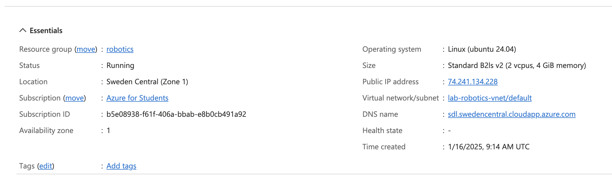

# 2025-01-17 
**Assignment 1**

Sidong Liu

## 1. Create Virtual Machine

I managed to create a Linux virtual machine from **Ubuntu Server 24.04 LTS gen 2** image at Microsoft Azure cloud platform. [portal.azure.com](https://portal.azure.com) 

Configuration:
- 2 vCPUs, 4 GiB RAM
- 30 GiB SSD disk 
- OS: Ubuntu Server 24.04 LTS gen 2
- Inbound Ports: 22, 80, 443
- Turn on auto-shutdown scheduled at 10:00 PM.
- Config DNS name for my VM. ```sdl.swedencentral.cloudapp.azure.com```

Also, I created my own system ID and generated SSH rsa key on my computer. 

### Generate an SSH key pair
[How to generate an SSH key pair? ][1]

On macOS, command is:
 ```sh
 ssh-keygen -b 4096 -t rsa
 ```
 By default, your keys will be saved as ```id_rsa``` and ```id_rsa.pub```. Copy the public key text to Azure VM before I can login via SSH.



## 2. Connect to Linux
Then, I can login to Linux OS through my SSH client using ssh key successfully.  

```sh
# ssh login command
ssh sd@sdl.swedencentral.cloudapp.azure.com
```


[1]: https://mdl.library.utoronto.ca/technology/tutorials/generating-ssh-key-pairs-mac