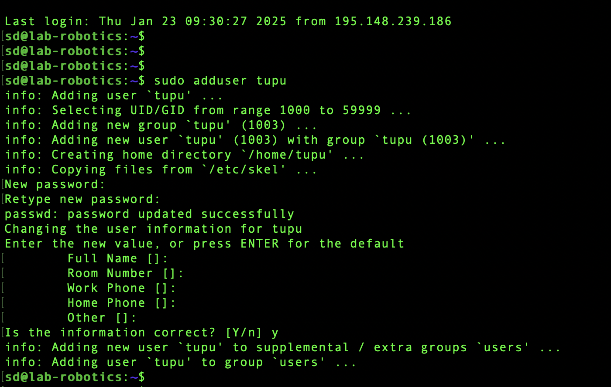
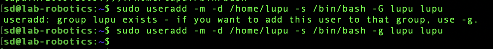
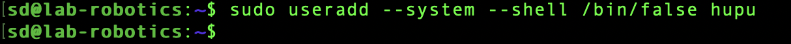
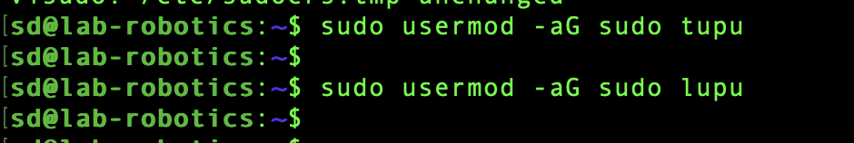
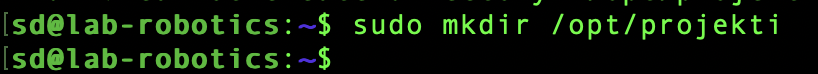
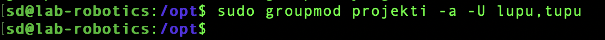

# 2025-01-29 
**Assignment 3**

Sidong Liu


Task
# 1. Create the Tupu user using the adduser script:

I type into the given command ```sudo adduser tupu``` after ssh login VM. Then, I follow the tips of creating new password and leave empty about other information. The user `tupu` creates successfully.



# 2. Create the Lupu user using the useradd command. Try to create a user profile, home directory, and user group similar to Tupu.

When type into the command `sudo useradd -m -d /home/lupu -s /bin/bash -G lupu lupu`, an error occurs `group 'lupu' does not exist`.


To solve this problem, I create the group 'lupu' with command `sudo groupadd lupu`.


Then, try useradd again. Another error appeared `group lupu exists - if you want to add this user to that group, use -g.`. Follow the tips, I modify the command argument -G to -g and try again. This time the command executes without errors.



# 3. Create the Hupu system user with the login shell set to /bin/false

The command `sudo useradd --system --shell /bin/false hupu` executes successfully.



# 4. Add the users Tupu and Lupu to the sudo users.

Using visudo to edit sudoers file and add the following lines:

```sh
tupu ALL=(ALL:ALL) ALL
lupu ALL=(ALL:ALL) ALL
```

Then, add users to the sudo group:
```sh
sudo usermod -aG sudo tupu
sudo usermod -aG sudo lupu
```



# 5. Create a directory /opt/projekti and add both users (Tupu and Lupu) as owners. Only Tupu and Lupu should have access to list files in the directory, read, and modify them.

Create a directory '/opt/projekti'.

```sh
sudo mkdir /opt/projekti
cd /opt/projekti
```



Create a group 'projekti' and add both tupu and lupu to the group.

```sh
sudo groupadd projekti

sudo groupmod projekti -a -U lupu,tupu
```




Then, change the directory group ownership to group 'projekti'. 

```sh
sudo chgrp projekti projekti/
```
