# 2025-02-06
**Assignment 6**

Sidong Liu

## Part 1

### 1. Check your system’s APT version:

Output:
```shell
sd@lab-robotics:~$ apt --version
apt 2.7.14 (amd64)
```

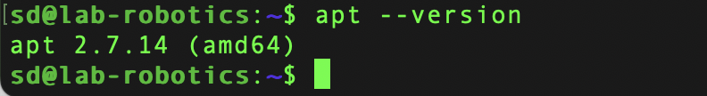

### 2. Update the package list:

```sh
sudo apt update

```

**Why this step is important?**

Because it ensures our system knows about the newest available software versions and security patches. Without it, apt would not be aware of the latest available package versions, which could result in installing older versions.

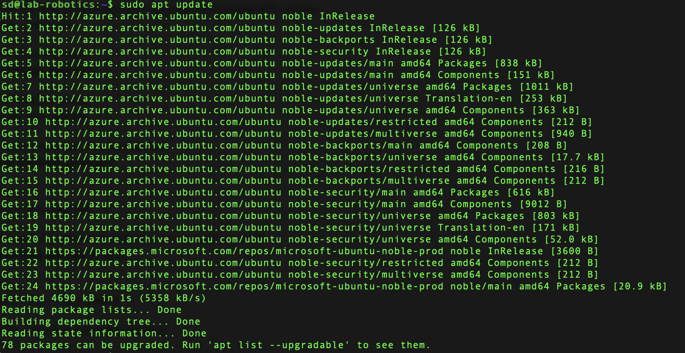

### 3. Upgrade installed packages
```sudo apt upgrade -y```


**What is the difference between update and upgrade?**

```apt update``` only downloads the package information, updates the list of available packages and their versions, and does not install any packages. 

```apt upgrade``` actually downloads and installs the newer versions of packages. 

### 4. View pending updates (if any)

```sh
sd@lab-robotics:~$ apt list --upgradable
Listing... Done
python-apt-common/noble-updates 2.7.7ubuntu4 all [upgradable from: 2.7.7ubuntu3]
python3-apt/noble-updates 2.7.7ubuntu4 amd64 [upgradable from: 2.7.7ubuntu3]
ubuntu-kernel-accessories/noble-updates 1.539.2 amd64 [upgradable from: 1.539.1]
ubuntu-minimal/noble-updates 1.539.2 amd64 [upgradable from: 1.539.1]
ubuntu-server/noble-updates 1.539.2 amd64 [upgradable from: 1.539.1]
ubuntu-standard/noble-updates 1.539.2 amd64 [upgradable from: 1.539.1]
```
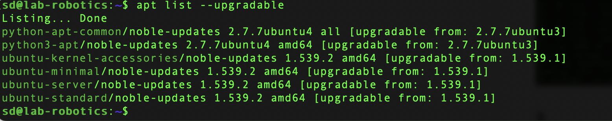

## Part 2
### 5. Search for a package using APT:

```sh
apt search image editor
```

One of the editor lists:
```sh
drawing/noble 1.0.2-1build1 amd64
  simple drawing application for the GNOME desktop
```

### 6. View package details:

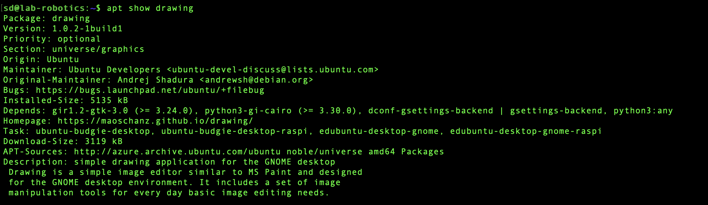

Depends: gir1.2-gtk-3.0 (>= 3.24.0), python3-gi-cairo (>= 3.30.0), dconf-gsettings-backend | gsettings-backend, python3:any


### 7. Install the package
```sh
sd@lab-robotics:~$ sudo apt install drawing -y
```

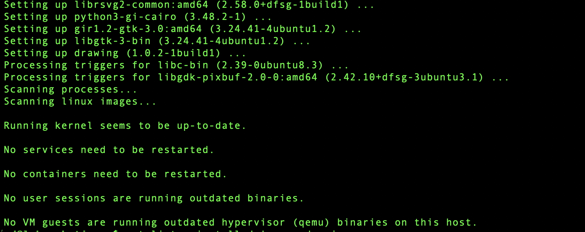

### 8. Check installed package version:

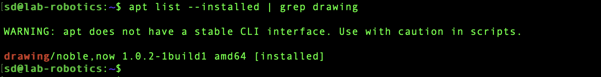

Installed version: 1.0.2-1build1

## Part 3 

### 9. Uninstall the package
```sh
sd@lab-robotics:~$ sudo apt remove drawing -y
```

#### Is the package fully removed?
The package is not fully removed. It removes the package's binaries but leaves behind configuration files and data files.

### 10. Remove configuration files as well:
```sh
sd@lab-robotics:~$ sudo apt purge drawing -y
```

#### What is the difference between remove and purge?

`remove` only removes package but keeps config files, while `purge` removes package and config files.

### 11. Clear unnecessary package dependencies:
```sh
sudo apt autoremove -y
```

#### Why is this step important?

Because it frees up disk space and reduces system complexity. 

12. Clean up downloaded package files:

```sh
sudo apt clean
```

#### What does this command do?

It deletes downloaded .deb package files that APT keeps after installing software.

## Part 4

### 13. List all APT repositories

```sh
cat /etc/apt/sources.list
```
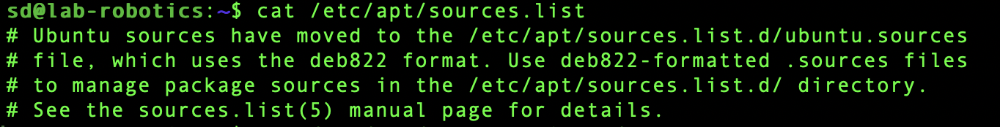

#### What do you notice in this file?
It is pointing to Azure's mirror of the Ubuntu repositories (azure.archive.ubuntu.com). 

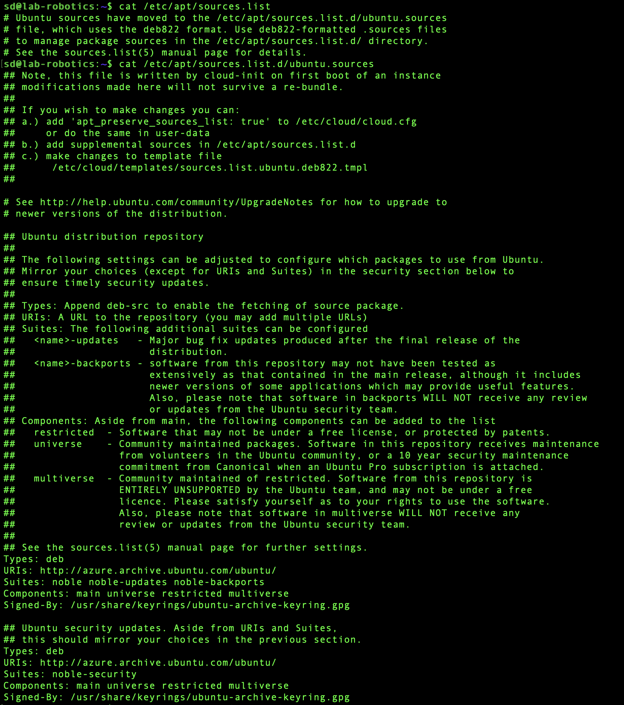


### 14. Add a new repository (example: universe repository)

```sh
sd@lab-robotics:~$ sudo add-apt-repository universe

sd@lab-robotics:~$ sudo apt update

```


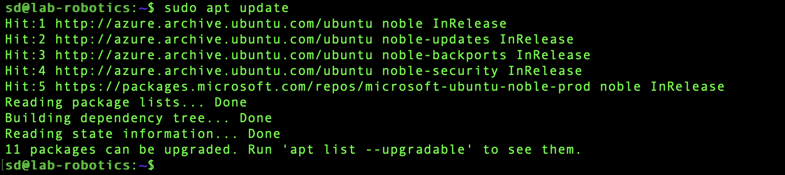

#### What types of packages are found in the universe repository?
```sh 
Hit:1 http://azure.archive.ubuntu.com/ubuntu noble InRelease
Hit:2 http://azure.archive.ubuntu.com/ubuntu noble-updates InRelease           
Hit:3 http://azure.archive.ubuntu.com/ubuntu noble-backports InRelease         
Hit:4 http://azure.archive.ubuntu.com/ubuntu noble-security InRelease          
Hit:5 https://packages.microsoft.com/repos/microsoft-ubuntu-noble-prod noble InRelease
```

### 15. Simulate an installation failure and troubleshoot:

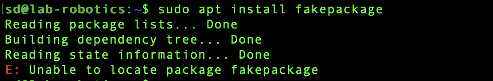

#### What error message do you get?

Error message is "E: Unable to locate package fakepackage".

#### How would you troubleshoot this issue?

We can use command 'apt list --installed | grep fakepackage' to find out if the package is intstalled before installing packages. 


### Bonus Challenge (Optional)

'sudo apt-mark hold '

'sudo apt-mark unhold '

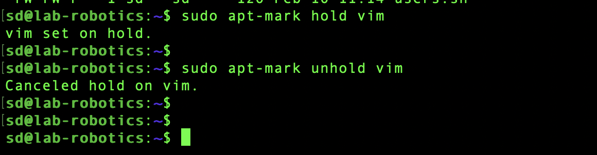

#### Why would you want to hold a package?

1. For stability. The current version works perfectly for your needs, and you want to avoid potential breaking changes from updates.

2. For compatibility. Your software depends on a specific version of the package, and upgrading might break functionality.
