# 2025-02-20
**Assignment 6**

Sidong Liu

## Part 1: Introduction to virtualization concepts

- Virtualization

Virtualization is a process that allows for more efficient use of physical computer hardware and is the foundation of cloud computing.

- Hypervisor

A hypervisor is the software layer that coordinates VMs. It serves as an interface between the VM and the underlying physical hardware, ensuring that each has access to the physical resources it needs to execute. It also ensures that the VMs don’t interfere with each other by impinging on each other’s memory space or compute cycles.

- Virtual machines (VM)

Virtual machines are virtual environments that simulate a physical computer in software form. They normally comprise several files containing the VM’s configuration, the storage for the virtual hard drive, and some snapshots of the VM that preserve its state at a particular point in time.

- Containers

Containers are executable units of software that package application code along with its libraries and dependencies. They allow code to run in any computing environment, whether it be desktop, traditional IT or cloud infrastructure.

- The main differences between VMs and tanks

### Summary
Summary in a text file briefly summarize the core differences between VMs and containers. Focus on their architecture, resource utilization, and insulation levels.


## Part 2: Working with Multipass


Multipass is a tool to generate cloud-style Ubuntu VMs quickly on Linux, macOS and Windows. 

### Install multipass
```sudo snap install multipass```


### Run

- multipass launch

```multipass launch```


```multipass launch jammy```

- multipass info: View details about a specific instance.

```multipass info legal-pig```

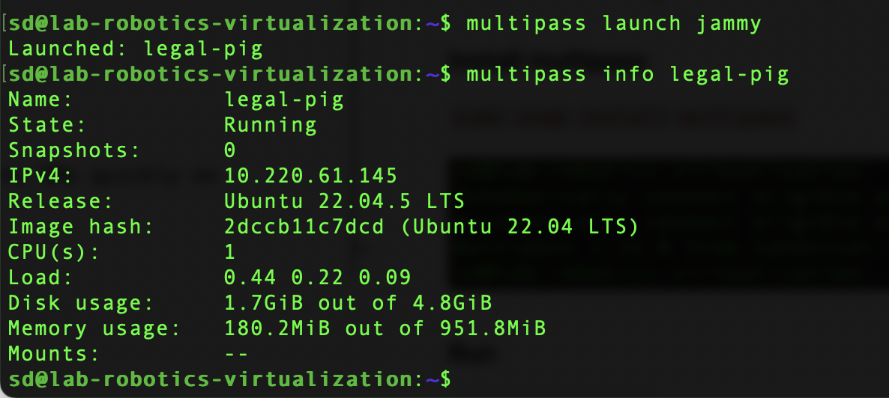

- multipass list: Lists all running instances.

```multipass list```


- multipass shell: Access to the shell of a running instance.

```multipass shell legal-pig```


- multipass exec: Run the command on the instance.

```multipass exec legal-pig -- pwd```


- multipass stop: Stop the running instance.

```multipass stop legal-pig```


- multipass delete: Delete the instance.

```multipass delete robust-grouper```


### Cloud-init:Study: Learn about cloud-initi and how it can be used to configure virtual machines


Cloud-init is the industry standard multi-distribution method for cross-platform cloud instance initialization. It is supported across all major public cloud providers, provisioning systems for private cloud infrastructure, and bare-metal installations.

#### Experiment: Create a cloud-init configuration file to customize the installation of a new instance. For example, you can install specific packages or assign users. Start a new instance of Multipass using this configuration.


```
sd@lab-robotics-virtualization:~$ cat >user-data <<EOF
> #cloud-config
password: password
chpasswd:
  expire: False
ssh_pwauth: True
EOF
```


#### Add packages config to user-data
```
packages:
  - nginx
```


```
sd@lab-robotics-virtualization:~$ multipass launch bionic --name test-vm --cloud-init user-data
```


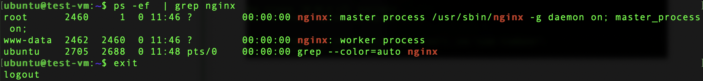


### File sharing: Find out: Explore how to share files and folders between your host computer and Multipass instances


There are two ways to accomplish this:

- the mount command, that maps a local folder to a new or existing folder in the instance’s filesystem
- the transfer command, that copies files to and from an instance

```multipass mount $HOME test-vm```

```multipass info test-vm```


### Policy: Create a shared folder and access it from both your host and your Multipass instance.


```
mkdir shared-folder

multipass mount ~/shared-folder test-vm

touch shared-folder/test.txt

```


## Part 3: Exploring LXD 

update your system by using apt: `apt update && apt upgrade -y`

Install Snap: `sudo apt install snap -y`

install lxd using snap: `sudo snap install lxd`

check that your user belongs to LXD group: id, and look for LXD. If you do not find lxd group, add user to it: `sudo usermod -aG lxd $USER`

initialize xld, to configure system to your environment: `lxd init`. 


```

$ lxc launch ubuntu:24.04 demo-container

$ lxc exec demo-container -- bash

```

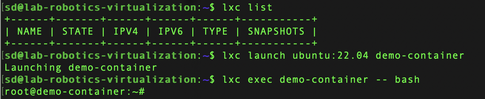


### Part 4: How to Stick Apps with Docker

**What is Docker?**

Docker is an open platform for developing, shipping, and running applications. Docker enables you to separate your applications from your infrastructure so you can deliver software quickly. 


#### Installation

```sh
curl -fsSL https://get.docker.com -o get-docker.sh
sudo sh get-docker.sh


sudo groupadd docker
sudo usermod -aG docker $USER
newgrp docker

```


#### Docker Workshop

**Get the app**

`git clone https://github.com/docker/getting-started-app.git`

**Build the app's image**

Create Dockerfile: 

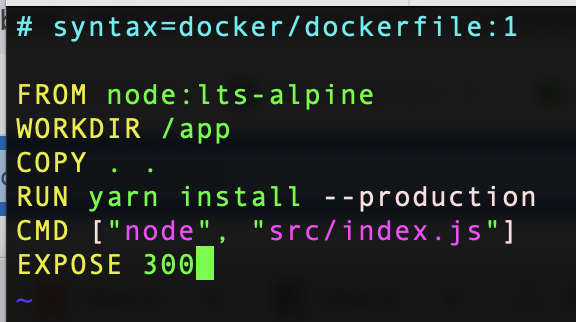


```sh
docker build -t getting-started .
```

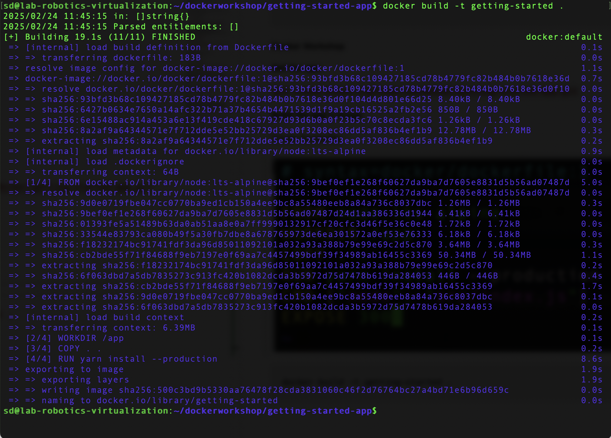

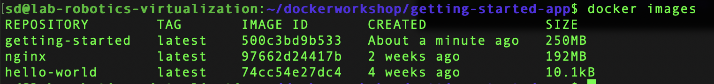


**Start an app container**

```sh

docker run -d -p 127.0.0.1:3000:3000 getting-started
```


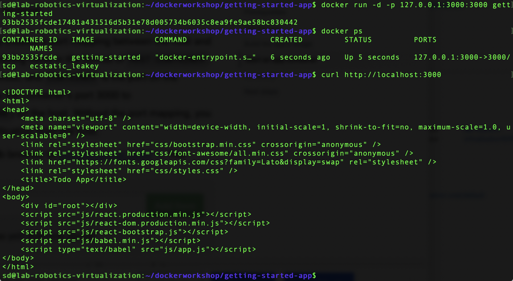


### Part 5: Snaps for Self-Contained Applications 


**Getting network errors**

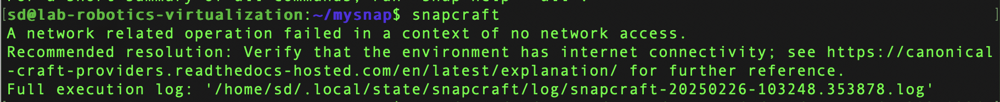


Go to the link according the message: 
https://canonical-craft-providers.readthedocs-hosted.com/en/latest/explanation/

I noticed the following message should be the problem I encountered. Go to the link and the easiest way to prevent such issues is to uninstall Docker from the system that runs LXD and restart the system. 

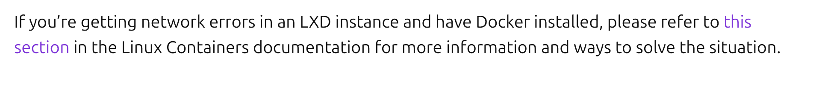

After restarting, the command runs successfully.

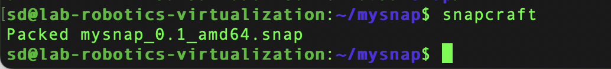


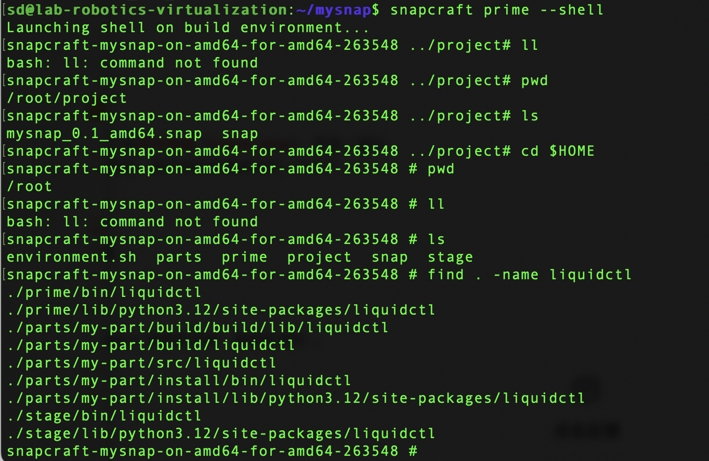

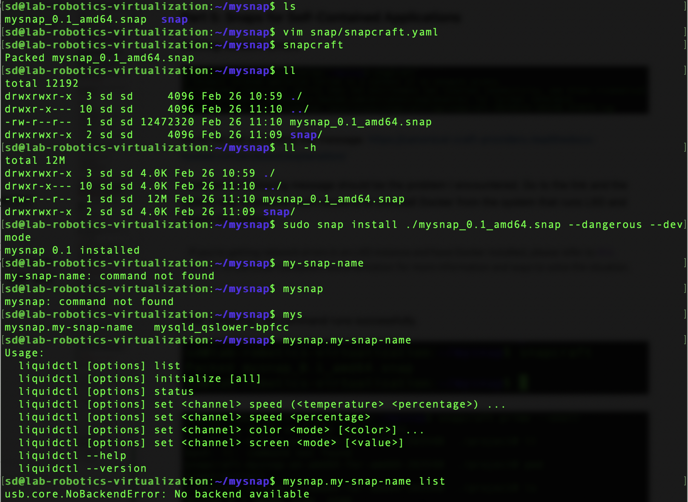